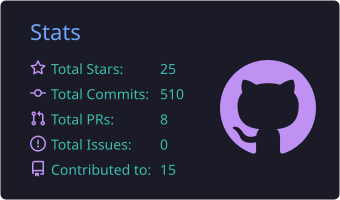
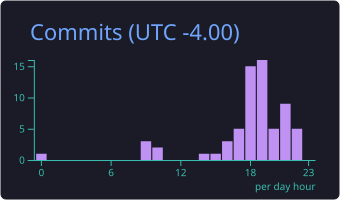
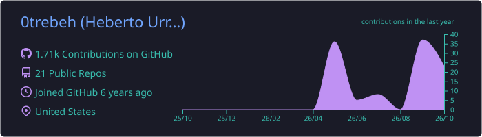

<div align="center">


<br/>

<a href="https://www.linkedin.com/in/heberto-urribarri-2223601a8/"></a>
<a href="#"></a>


</div>

---

## 👨‍💻 About me

**Computer Engineer with 6+ years of experience** building web, desktop and automation solutions for companies in the United States, Colombia and Venezuela — both in-house and as a freelancer.

I specialize in the kind of software that pays for itself: **ETL pipelines, process automation and internal tools** that turn hours of manual work into minutes, alongside full stack products that real users rely on every day.

```ts
const heberto = {
  role:        "Software Engineer",
  focus:       ["Full Stack", "Automation", "Data / ETL", "AI Agents"],
  stack:       ["TypeScript", "React", "Node.js", "C# / ASP.NET Core", "Python", "SQL"],
  languages:   ["Spanish (native)", "English (B2+)"],
  methodology: ["Scrum", "Extreme Programming"],
  location:    "Orlando, FL 🇺🇸",
};
```

---

## 💼 Experience

**Software Engineer** · *United Data Technologies* · 🇺🇸 · `2024 – 2025`
- Designed an **ETL system** that extracts data from ConnectWise into SQL Server — processing went from **hours to minutes**.
- Built automation flows with **Power Automate + Selenium**, including a scraping bot that cut administrative work by **85%** and a fully automated QC process.
- Optimized and audited the company's **SQL Server** database for faster, more reliable queries.
- Refactored the internal **Razor dashboard**, improving security and replacing third-party tools.
- Shipped an **ASP.NET Core desktop app** for automated USB testing: **14 → 2 minutes** per device.

**Full Stack Developer** · *Addin Technologies SAS* · 🇨🇴 Remote · `2023 – 2024`
- Built a multi-user **content-sharing platform (B2C)** on the MERN stack, deployed to **1,000+ users**, with **+28% SEO** performance.
- **Led a team of 4** to deliver a **veterinary booking platform (B2B)** — MVP in production in **1 month**.

**Freelance Developer** · *Vymg S.A, Cubisystem C.A & private clients* · 🌎 Remote · `2020 – Present`
- **AI agents**, automations, scripts, websites, MVPs and complete systems — including **Odoo Community** implementations.
- End-to-end ownership: requirements gathering, budgeting, development and technical documentation.

**Intern** · *Inverdata Software & Technology* · 🇻🇪 · `2021`
- Built responsive pages with the **PERN** stack and Ant Design in a team of 6.

---

## 🛠️ Tech stack

<div align="center">

**Languages**


**Frontend & Backend**


**Databases**


**Cloud & DevOps**


**Automation, ERP & Tools**


</div>

---

## 🎓 Education & certifications

- 🎓 **B.S. in Computer Engineering** — Universidad Rafael Urdaneta (URU), 2018 – 2022 · Member of CIIM (Mechatronics Research & Innovation Club)
- 🛡️ **Ethical Hacker** · **Cybersecurity Essentials** — Cisco
- 🐍 **Python 1 & 2** — Python Institute
- 🗄️ **SQL and Relational Databases** — IBM
- 🔄 **Scrum Foundation Professional** — CertiProf
- 🌐 **EF SET English Certificate** — B2 Upper Intermediate

---

## 📊 GitHub stats

<div align="center">






</div>

---

<div align="center">

### 🤝 Let's build something

I'm open to **full-time roles, contract work and freelance projects** — especially where automation, data or a full stack product can make a measurable difference.

<a href="https://www.linkedin.com/in/heberto-urribarri-2223601a8/"></a>
<a href="#"></a>


</div>
